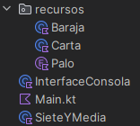

# SieteYmediaRefac  ¡En KOTLIN!

Refactorizar un proyecto existente para que cumpla la [arquitectura de dos capas](https://manuais.pages.iessanclemente.net/apuntes/2.programacion/kotlin/06_disenoorientadoobjetos/61.arquitecturacapas/1.dosniveles/index.html).

## Juego siete y media
Las  siguientes  clases implementan una versión muy reducida del famoso juego de cartas siete y media. En esta versión, hay dos jugadores, el usuario y la banca. La banca es el ordenador (nuestro programa). Respecto al juego original, en esta versión simplifica varios aspectos, observa que no  hay apuestas y sólo se juega una mano. El funcionamiento concreto se aprecia fácilmente si descargas el  código  y ejecutas  el programa. El programa incluye al principio una  explicación del juego.

Observa que la clase GameControler mezcla la lógica de negocio y la lógica de presentación, y por lo tanto,  claramente no cumple el [principio de responsabilidad única](https://manuais.pages.iessanclemente.net/apuntes/2.programacion/kotlin/06_disenoorientadoobjetos/62.principiossolid/1.srp/index.html). 

## SE PIDE
Reestructurar el  proyecto  de forma que:  
- El paquete recursos es el mismo. 
- Gamecontroler desaparece para dividirse  en dos clases
   - SieteYMedia.java 
   - InterfaceConsola.
     

Quedando por tanto la App organizada en:
- Capa lógica: clases de paquete recursos y clase SieteYMedia
- Capa presentación: Clase InterfaceConsola

Para conseguir el efecto deseado observa que:
- La aplicación ahora es más compleja, se divide una clase en dos y surgen nuevos métodos necesarios para la comunicación entre ellas. ¿Merece la pena?. Vamos a suponer que sí porque queremos hacer más adelante para este juego su versión gráfica, de esta manera, separando la lógica de la presentación  sólo tendremos que volver a escribir la clase Interface para adecuarla a la nueva entrada/salida pero la clase SieteYMedia no tendremos que tocarla.
- SieteYMedia debe estar escrita de forma que sea reutilizable en una aplicación gráfica o web. El teclado y la pantalla sólo los maneja InterfaceConsola. ¡ni un println ni un readln()/Scanner en SieteYMedia!
- ¿Cómo devuelve los datos SieteYMedia a InterfaceConsola?. Supongamos que InterfaceConsola quiere imprimir las cartas que tiene en un momento dado el Jugador ¿Cómo le pasa SieteYMedia esta información a interfaceConsola?. SieteYMedia puede devolver un simple String para que lo imprima InterfaceConsola o bien una estructura más compleja como una lista  de cartas. La primera es muy sencilla  pero la segunda es más flexible ya que conduce  a InterfaceConsola a  imprimir un String concreto que a lo mejor querría con otro formato, en otro idioma, etc.. Usamos la segunda!

- piensa detenidamente que si quiero que SieteYMedia sea una clase independiente de la E/S: ¿InterfaceConsola usa y conoce la existencia de SieteYMedia?, o bien, es SieteYMedia quien usa y conoce la existencia de InterfaceConsola?
  
El check esencial para saber si hicimos bien nuestro trabajo es: puedo reutilizar mi clase SieteYMedia, sin modificarla,  en otra App que por ejemplo tenga una interfac gráfica
